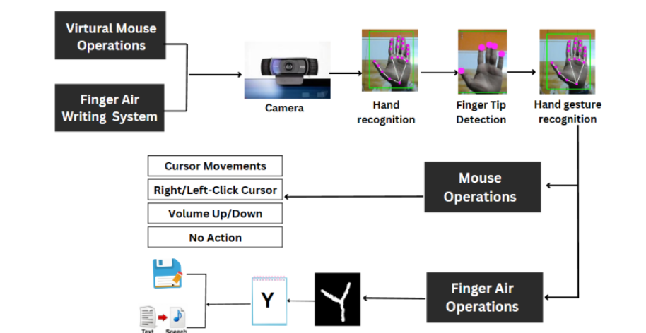

# Gesture-Controlled Virtual Mouse and Finger Air Writing 



This project allows you to control a virtual mouse and perform finger air writing using gesture recognition. It utilizes computer vision and deep learning techniques to detect hand gestures and translate them into mouse movements and text.

### How to Run the Project

1. **Fork and Clone the Repository**
   - Start by forking the repository to your GitHub account.
   - Clone the forked repository to your local machine using the following command in the terminal:
     ```bash
     git clone https://github.com/Anushreebasics/Anuva_CV-DL_project.git
     ```

2. **Open the Project**
   - Open the project in Visual Studio Code (VS Code) or any preferred code editor.
   - Adjust the path variables in the code to match the location of the project on your machine.

3. **Launch the Application**
   - Run the `GUI.py` file to launch the application.

4. ## Gesture-Controlled Virtual Mouse
   - Raise only the index finger to bring the mouse into the moving state.
   - Raise all the fingers except the thumb to lower the volume.
   - Raise index finger, middle finger, and ring finger to increase the volume.
   - Pinch with the thumb and index finger for a right-click.
   - Pinch with the index finger and middle finger for a left-click.

5. ## Finger Air Writing
   - Upon execution, the application will open a canvas along with an image window in the background.
   - The "Clear" function allows you to erase all the text or drawings on the canvas, providing a clean slate.
   - Use the "Back" function to remove the most recently added text, digit, space, or special character from the canvas, acting like a backspace.
   - Press the "Space" button to insert a space character on the canvas, useful for adding gaps between words or elements.
   - Click the "Predict" button, and the application will attempt to predict the character that you have drawn on the canvas.
   - The "Save" function enables you to save the content on the canvas, preserving your work for future reference or sharing.
   - Use the "Color" button to change the pen's color, allowing you to draw or write in different hues.
   - You can switch to mouse mode using the "Mouse" button.

 
